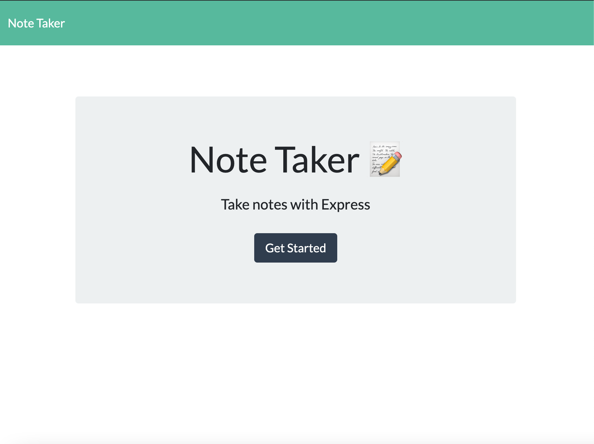
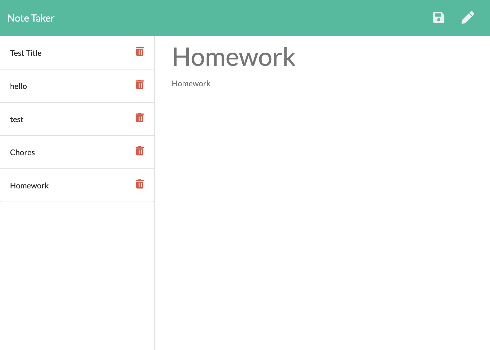

 ### Note Taker 
  ### https://github.com/alexreveles
  ## Description
  Note Taker was designed to help small business owners write down and save task that need to be completed and keep an organize schedule.
  ##  Table of Contents
  * [Installation](#installation)
  * [Usage](#usage)
  * [License](#License)
  * [Contributing](#contributing)
  * [Tests](#Tests)
  * [Questions](#questions)
  ## Installation
  The dependencies are necessary to be installed to be able to run the application To Run this application you are required to install nodemon, npm express, and npm package called "uuid".
  ## Usage
  In order to run this application, This application is used creating your own server and running it in your terminal.
  
  # License
  This project is  licensed MIT license.
  
  ## Contributing
  Contributors: Alex Reveles
  ## Test
  The following is needed to run the test: The only command needed to run this application is, "nodemon server.js"
  ## Questions
  If you have any questions regarding about the application, please contact me alexreveles@yahoo.com

### Heroku Deployed Link: https://enigmatic-gorge-52520.herokuapp.com/

### Githublink: https://github.com/alexreveles/note-taker

